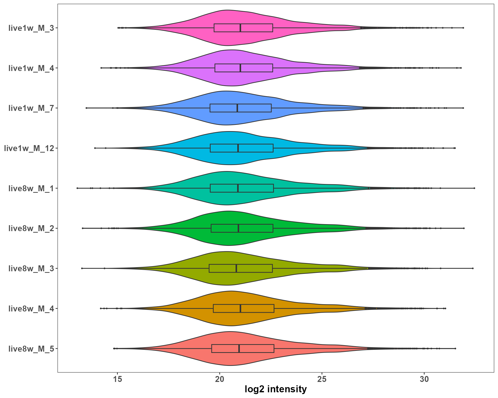
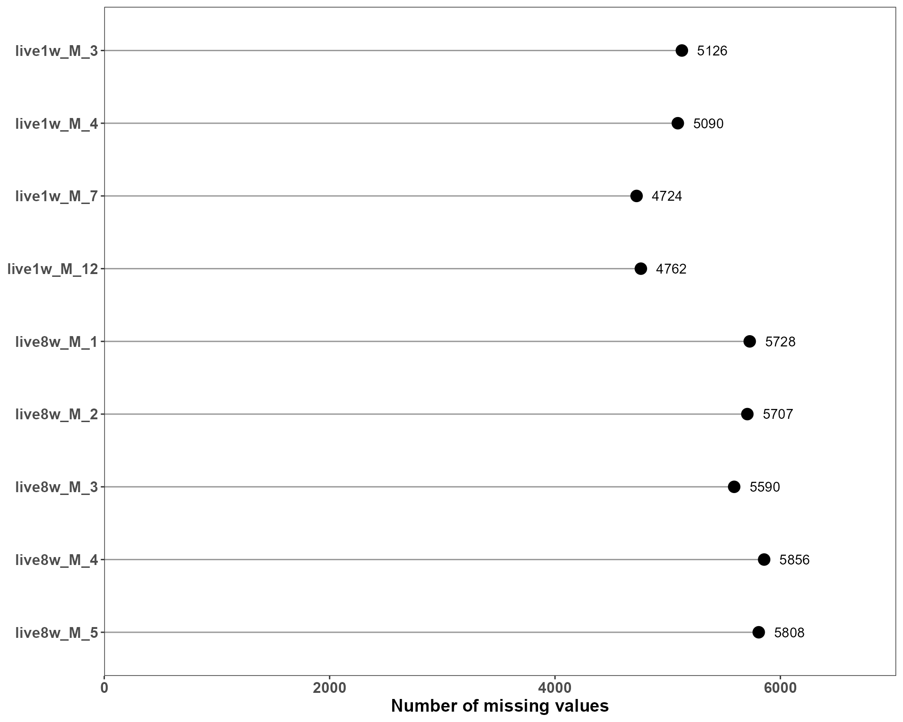
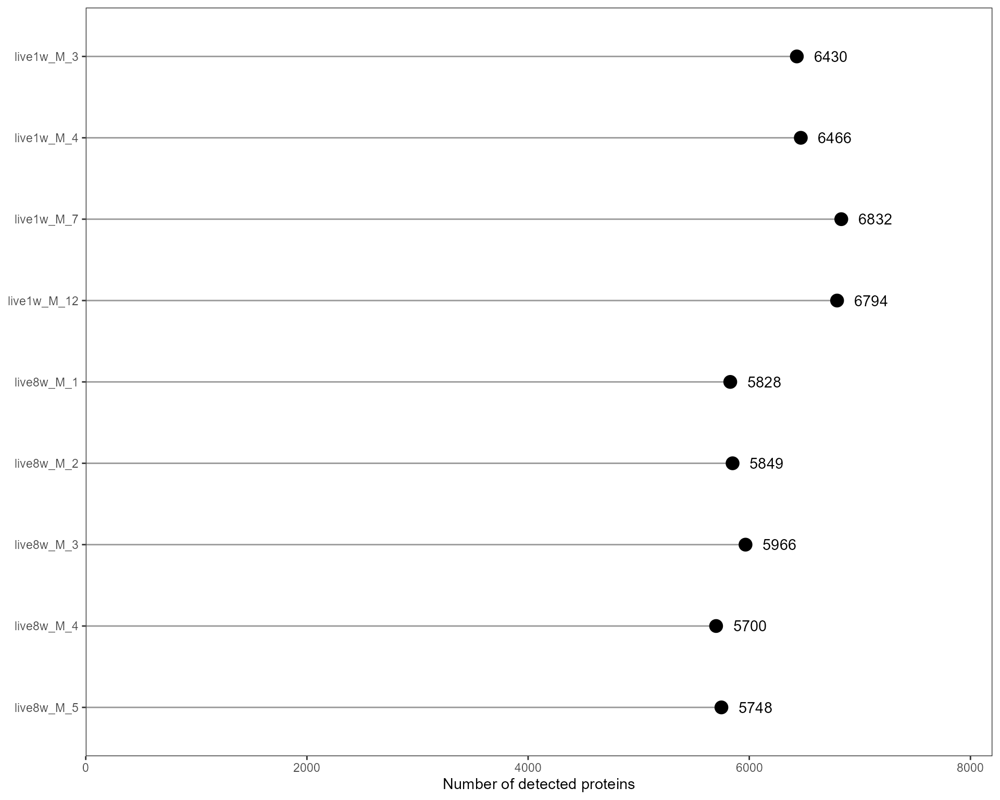
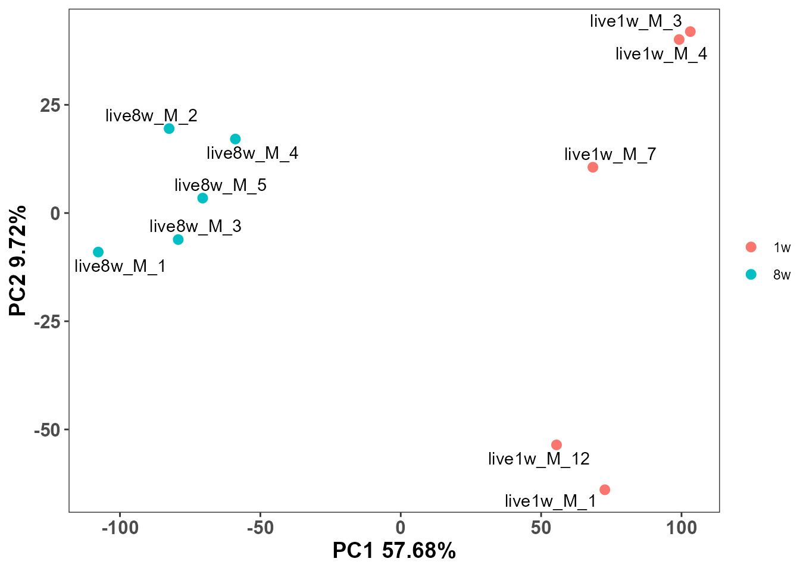

# Quick Start with EasyProtein

``` r
suppressPackageStartupMessages({
  library(EasyProtein)
  library(tidyverse)
  library(SummarizedExperiment)
})
#> Warning: package 'ggplot2' was built under R version 4.5.2
#> Warning: package 'tibble' was built under R version 4.5.2
#> Warning: package 'tidyr' was built under R version 4.5.2
#> Warning: package 'readr' was built under R version 4.5.2
#> Warning: package 'purrr' was built under R version 4.5.2
#> Warning: package 'stringr' was built under R version 4.5.2
#> Warning: package 'SummarizedExperiment' was built under R version 4.5.2
#> Warning: package 'MatrixGenerics' was built under R version 4.5.2
#> Warning: package 'GenomicRanges' was built under R version 4.5.2
#> Warning: package 'BiocGenerics' was built under R version 4.5.2
#> Warning: package 'S4Vectors' was built under R version 4.5.2
#> Warning: package 'IRanges' was built under R version 4.5.2
#> Warning: package 'Seqinfo' was built under R version 4.5.2
#> Warning: package 'Biobase' was built under R version 4.5.2
```

## Quick Start with EasyProtein

### 1. Tutorial metadata

- **Tutorial name**: Quick Start with EasyProtein  
- **Tutorial type**: Minimal end-to-end workflow  
- **Target audience**: First-time users of EasyProtein  
- **Primary goal**: Show how to complete a basic proteomics analysis
  workflow with minimal input and minimal parameter tuning  
- **Expected outcome**: You will learn how to:
  1.  load example data
  2.  create a standard EasyProtein analysis object
  3.  inspect data quality
  4.  visualize sample structure
  5.  perform a simple two-group comparison (**Liver, 1w vs 8w, male
      only**)
  6.  interpret core outputs

### 2. Load example data and build `SummarizedExperiment`

This tutorial uses the file
`inst/extdata/mouse_multi-organ_DIA_report.pg_matrix.tsv.gz`.

``` r
exp_file <- system.file(
  "extdata",
  "mouse_multi-organ_DIA_report.pg_matrix.tsv.gz",
  package = "EasyProtein"
)

stopifnot(file.exists(exp_file))

se_obj <- rawdata2se(exp_file)
se <- se_obj$se
se
#> class: SummarizedExperiment 
#> dim: 11497 299 
#> metadata(0):
#> assays(4): raw_intensity intensity conc zscale
#> rownames(11497): 0610012G03Rik 1700010I14Rik ... mt-Nd3 rp9
#> rowData names(1): gene
#> colnames(299): brain_1w_F_5 brain_1w_F_7 ... Muscle8w_M_4 Muscle8w_M_5
#> colData names(4): sample condition rep group
```

### 3. Add sample metadata

[`rawdata2se()`](https://yuanlizhanshi.github.io/EasyProtein/reference/rawdata2se.md)
already creates basic `condition` and `rep`. Here we derive `tissue`,
`age`, and `sex` from `condition` as requested.

``` r
se$tissue <- str_extract(se$condition,'[A-Za-z]+')
se$age <- str_extract(se$condition,'\\dw')
se$sex <- str_extract(se$condition,'\\w$')

as.data.frame(SummarizedExperiment::colData(se)) %>%
  dplyr::select(sample, condition, rep, tissue, age, sex) %>%
  head()
#>                      sample  condition rep tissue age sex
#> brain_1w_F_5   brain_1w_F_5 brain_1w_F   5  brain  1w   F
#> brain_1w_F_7   brain_1w_F_7 brain_1w_F   7  brain  1w   F
#> brain_1w_F_8   brain_1w_F_8 brain_1w_F   8  brain  1w   F
#> brain_1w_F_10 brain_1w_F_10 brain_1w_F  10  brain  1w   F
#> brain_1w_M_1   brain_1w_M_1 brain_1w_M   1  brain  1w   M
#> brain_1w_M_3   brain_1w_M_3 brain_1w_M   3  brain  1w   M
```

### 4. Quick QC

We inspect three basic QC aspects:

1.  sample intensity distribution
2.  missing values per sample
3.  detected protein number per sample

``` r
keep <- se$tissue == "live" &
  se$sex == "M" &
  se$age %in% c("1w", "8w")

se_sub <- se[, keep]


p_density <- plotSE_density(se_sub)
p_missing <- plotSE_missing_value(se_sub)
p_detected <- plotSE_protein_number(se_sub)

p_density
```



``` r
p_missing
```



``` r
p_detected
```



### 5. Visualize sample structure with PCA

Use concentration matrix (`assay = "conc"`) and color by tissue.

``` r
conc_mtx <- SummarizedExperiment::assay(se_sub, "conc")

pca.res <- FactoMineR::PCA(t(conc_mtx), graph = FALSE)
pca.df <- as.data.frame(pca.res$ind$coord)
pca.df$sample <- rownames(pca.df)

meta_df <- as.data.frame(SummarizedExperiment::colData(se_sub)) 

pca.df <- dplyr::left_join(pca.df, meta_df, by = "sample")

plot_pca(
  pca.df = pca.df,
  pca.res = pca.res,
  colorby = "age",
  label = "sample"
)
#> Warning: `aes_string()` was deprecated in ggplot2 3.0.0.
#> ℹ Please use tidy evaluation idioms with `aes()`.
#> ℹ See also `vignette("ggplot2-in-packages")` for more information.
#> ℹ The deprecated feature was likely used in the EasyProtein package.
#>   Please report the issue at
#>   <https://github.com/yuanlizhanshi/EasyProtein/issues>.
#> This warning is displayed once per session.
#> Call `lifecycle::last_lifecycle_warnings()` to see where this warning was
#> generated.
```



### 6. Two-group comparison: Liver, 1w vs 8w, male only

We subset samples to:

- `tissue == "Liver"`
- `sex == "m"`
- `age %in% c("1w", "8w")`

Then run unpaired limma-based DEG analysis via
[`se2DEGs()`](https://yuanlizhanshi.github.io/EasyProtein/reference/se2DEGs.md).

``` r
deg_res <- se2DEGs(
  se = se_sub,
  compare_col = "age",
  ref = "1w",
  cmp = "8w",
  logFC_cutoff = 1,
  adj_p_cutoff = 0.05
)

head(deg_res)
#>            gene live1w_M_1   live1w_M_3   live1w_M_4 live1w_M_7 live1w_M_12
#> 1 0610012G03Rik  3.4170122    2.7307321    3.5057499  4.4052290    3.345071
#> 2 1700010I14Rik  0.9392232    0.9654005    0.9636142  0.9366667    0.919449
#> 3 1810009J06Rik  0.4087430 3551.7545240 1793.9272352 38.1159646 3649.433156
#> 4 1810024B03Rik  0.9392232    0.9654005    0.9636142  0.9366667    0.919449
#> 5 1810065E05Rik 41.1277752   42.2740584   42.1958388 41.0158293   40.261882
#> 6 2010106E10Rik  0.9392232    0.9654005    0.9636142  0.9366667    0.919449
#>     live8w_M_1   live8w_M_2  live8w_M_3   live8w_M_4   live8w_M_5 mean_log2_1w
#> 1    1.8695419    1.9201328    1.929792    1.9712530    1.9541805   1.80002963
#> 2    0.9446468    0.9702095    0.975090    0.9960396    0.9874132  -0.02024861
#> 3 3016.5522357 3098.1819292 3113.766947 3180.6656198 3153.1188707   7.70778304
#> 4    0.9446468    0.9702095    0.975090    0.9960396    0.9874132  -0.02024861
#> 5    0.9446468    0.9702095    0.975090    0.9960396    0.9874132   5.37188591
#> 6    0.9446468    0.9702095    0.975090    0.9960396    0.9874132  -0.02024861
#>   mean_log2_8w       logFC      P.Value    adj.P.Val    median_1w   median_8w
#> 1   0.97820863 -0.82182099 4.856343e-05 2.118110e-04    3.4170122    1.929792
#> 2   0.02272051  0.04296912 3.520132e-02 4.948155e-02    0.9392232    0.975090
#> 3  11.60362179  3.89583875 1.374975e-01 1.724268e-01 1793.9272352 3113.766947
#> 4   0.02272051  0.04296912 3.520132e-02 4.948155e-02    0.9392232    0.975090
#> 5   0.02272051 -5.34916541 5.591284e-15 5.541638e-13   41.1277752    0.975090
#> 6   0.02272051  0.04296912 3.520132e-02 4.948155e-02    0.9392232    0.975090
#>   DEGs_types
#> 1         NS
#> 2         NS
#> 3         NS
#> 4         NS
#> 5       DOWN
#> 6         NS
table(deg_res$DEGs_types)
#> 
#> DOWN   NS   UP 
#> 1725 8983  789
```

### 7. Interpret core outputs

The DEG result table contains:

- **effect size**: `logFC` (positive means higher in `8w` vs `1w`)
- **statistical significance**: `P.Value`, `adj.P.Val`
- **classification**: `DEGs_types` (`UP`, `DOWN`, `NS`)
- **group summaries**: `median_1w`, `median_8w`

Minimal interpretation workflow:

1.  prioritize proteins with `adj.P.Val <= 0.05`
2.  use `|logFC| >= 1` to focus on stronger changes
3.  read `median_1w` and `median_8w` together with `logFC`

``` r
top_hits <- deg_res %>%
  dplyr::arrange(adj.P.Val, dplyr::desc(abs(logFC))) %>%
  dplyr::select(gene, logFC, adj.P.Val, DEGs_types, starts_with("median_"))

head(top_hits, 20)
#>        gene     logFC    adj.P.Val DEGs_types   median_1w  median_8w
#> 1    Csn1s1 10.182433 8.013961e-16         UP   0.9392232 1146.46359
#> 2     Cdca3 10.040292 8.013961e-16         UP   0.9392232 1038.89116
#> 3  Naaladl1  9.982767 8.013961e-16         UP   0.9392232  998.27682
#> 4     Stx1b  9.618075 9.323407e-16         UP   0.9392232  775.29011
#> 5    Mybpc1 -9.576063 9.323407e-16       DOWN 770.8484387    0.97509
#> 6       Cck  9.184286 1.558556e-15         UP   0.9392232  573.94779
#> 7    Defa21 -8.684485 3.045286e-15       DOWN 415.4870265    0.97509
#> 8      Eml6  8.494027 5.434018e-15         UP   0.9392232  353.90296
#> 9    Metrnl -8.253243 5.434018e-15       DOWN 308.1239990    0.97509
#> 10    Sytl1  8.107017 5.973509e-15         UP   0.9392232  271.98647
#> 11    Myom1  8.104425 5.973509e-15         UP   0.9392232  271.49834
#> 12     Nefh -8.101866 5.973509e-15       DOWN 277.4279338    0.97509
#> 13   Atp1b4  7.939756 7.849712e-15         UP   0.9392232  242.20809
#> 14   Eef1a2 -7.715343 1.091110e-14       DOWN 212.2146391    0.97509
#> 15     Nefl  7.687151 1.189352e-14         UP   0.9392232  203.29790
#> 16    Krt85  7.607042 1.190601e-14         UP   0.9392232  192.31482
#> 17   Pmfbp1  7.587927 1.190601e-14         UP   0.9392232  189.78299
#> 18    Krt17  7.560404 1.190601e-14         UP   0.9392232  186.19589
#> 19   Trim54  7.531913 1.190601e-14         UP   0.9392232  182.55411
#> 20     Has1 -7.481887 1.190601e-14       DOWN 180.5026100    0.97509
```

### 8. Save results (optional)

``` r
write.csv(deg_res, "Liver_male_1w_vs_8w_DEGs.csv", row.names = FALSE)
```
